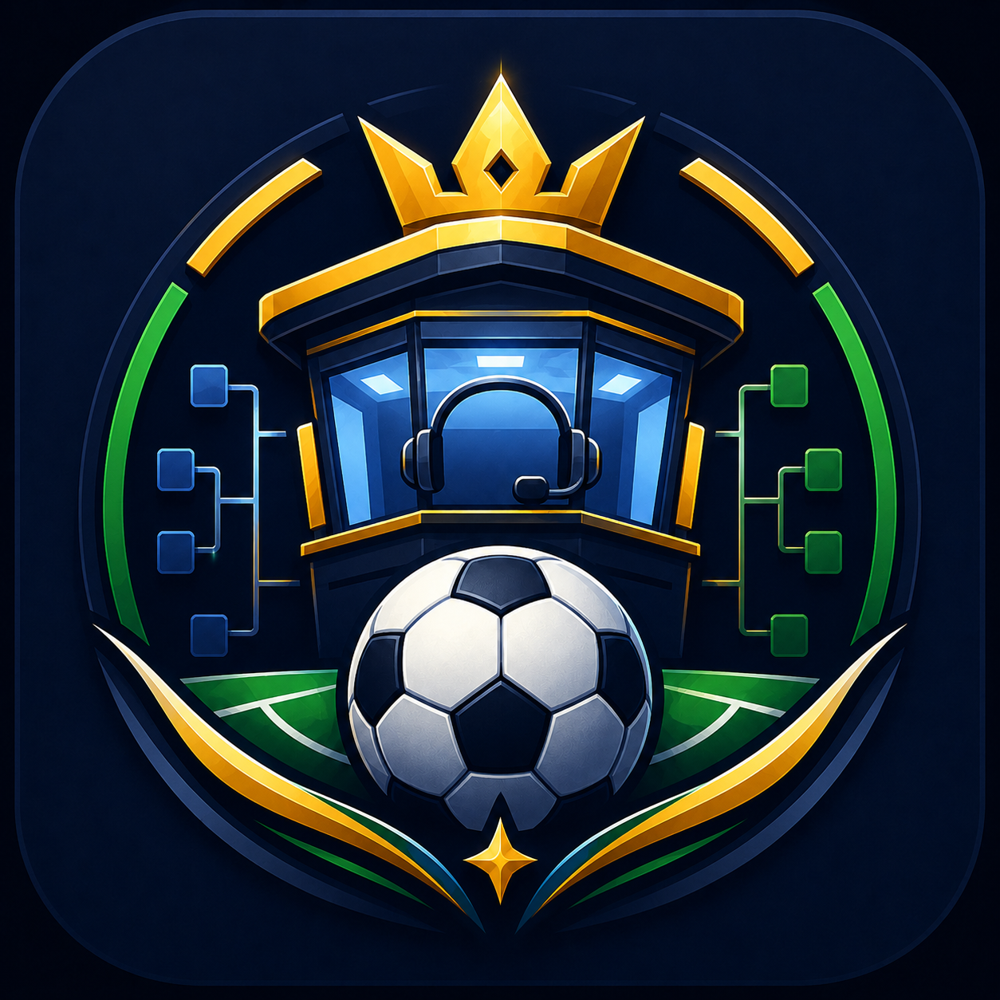

<div align="center">
  

  <h1>Cabine do Glória FC (CopaBot)</h1>

  <p><strong>Bot Discord para a Copa do Mundo 2026 — jogos, lembretes, bolão e enquetes.</strong></p>
  <p><strong>Discord bot for the 2026 World Cup — matches, reminders, pools and polls.</strong></p>

  <p>
    <a href="#pt-br">PT-BR</a>
     · 
    <a href="#english">English</a>
     · 
    <a href="#stack">Stack</a>
     · 
    <a href="#architecture">Architecture</a>
     · 
    <a href="#quick-start">Quick Start</a>
     · 
    <a href="#author">Author</a>
  </p>

  <p>
    
    
    
    
  </p>

  <p>
    <a href="https://github.com/BarujaFe1/CopaBot"><strong>Repo</strong></a>
     · 
    <a href="https://barujafe.vercel.app/"><strong>Portfolio</strong></a>
     · 
    <a href="https://www.linkedin.com/in/barujafe/"><strong>LinkedIn</strong></a>
  </p>
</div>


> **Bot notice:** Discord application — **no** public web demo. Requires your own Discord application token and guild configuration. Related product: Streamlit pool app **Bolão da Cabine do Glória**.

---

## PT-BR

### Visão geral
O **CopaBot** (Cabine do Glória FC) é um bot Discord (discord.js 14) para a Copa 2026: agenda de jogos, lembretes, palpites/bolão, ranking de atividade e enquetes.

### Problema
Comunidades no Discord perdem jogos, espalham palpites em mensagens soltas e não têm ranking/lembretes padronizados.

### Para quem
Servidores de torcida/amigos que querem **operações de Copa** dentro do Discord.

### Funcionalidades (comandos em `src/commands`)
- Jogos / próximos / fase / times (ex.: brasil, argentina)
- Lembretes e configuração de cargos
- Bolão: abrir/fechar palpite, meus palpites, resultado, ranking
- Enquetes e enquete de transmissão
- Ranking de atividade / reset
- Dados JSON da Copa em `src/data`

### Escopo e limites (honestos)
- Bot Discord — sem homepage web de produto
- Resultados/agenda dependem dos dados e processos do servidor
- Hospedagem (Railway/Render/VPS) é responsabilidade do operador

---

## English

### Overview
**CopaBot** (Cabine do Glória FC) is a discord.js 14 bot for World Cup 2026: match agenda, reminders, pick’em pool, activity ranking and polls.

### Problem
Discord communities miss matches, scatter picks across chat and lack standardized reminders/rankings.

### Who it is for
Fan/friend servers that want **World Cup operations** inside Discord.

### Features (commands under `src/commands`)
- Matches / upcoming / stage / teams
- Reminders and role configuration
- Pool: open/close picks, my picks, results, ranking
- Polls and broadcast polls
- Activity ranking / reset
- Cup JSON data in `src/data`

### Scope and honest limits
- Discord bot — no product web homepage
- Results/schedule quality depends on your data/process
- Hosting is on the operator

---

## Stack

| Layer | Technology |
|---|---|
| Runtime | Node.js 18+, discord.js 14 |
| Data | JSON files under `src/data` + storage helpers |

---

## Architecture

```txt
src/index.js          bot entry
src/commands/         slash commands
src/events/           discord events
src/services/         domain services
src/deploy-commands.js
```

---

## Quick Start

```bash
cp .env.example .env   # DISCORD token + client IDs
npm install
node src/deploy-commands.js
node src/index.js
```

---

## Technical decisions

- **Slash commands** for discoverable Cup operations
- JSON datasets for schedule/groups to iterate without a DB
- Modular commands/services for a growing World Cup feature set

---

## Roadmap

- Tighter coupling with the Streamlit bolão app
- Better reminder reliability
- Richer transmission/poll UX

---

## Author

**Felipe Alirio Baruja** — data / product / full-stack portfolio.

- Portfolio: [https://barujafe.vercel.app/](https://barujafe.vercel.app/)
- GitHub: [https://github.com/BarujaFe1](https://github.com/BarujaFe1)
- LinkedIn: [https://www.linkedin.com/in/barujafe/](https://www.linkedin.com/in/barujafe/)


## License

MIT — see [`LICENSE`](./LICENSE).
